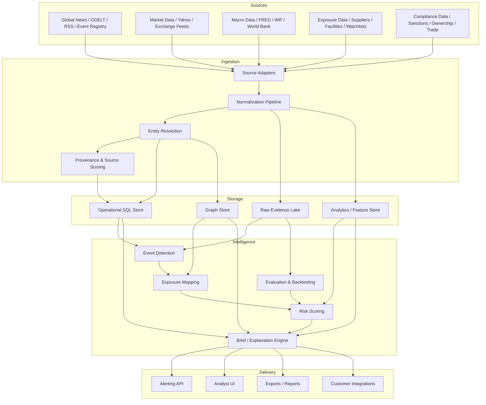
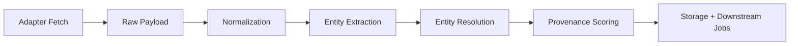
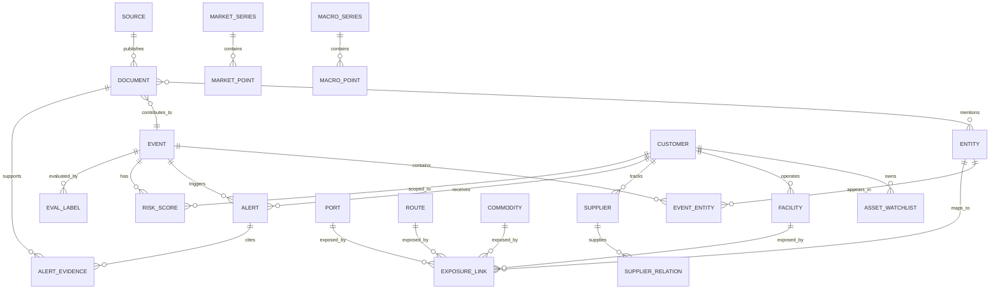
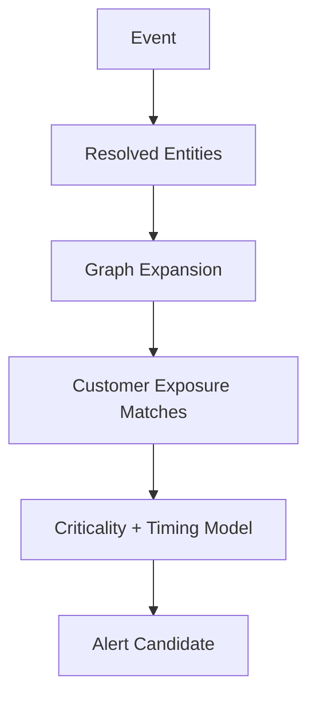
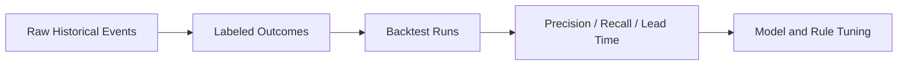
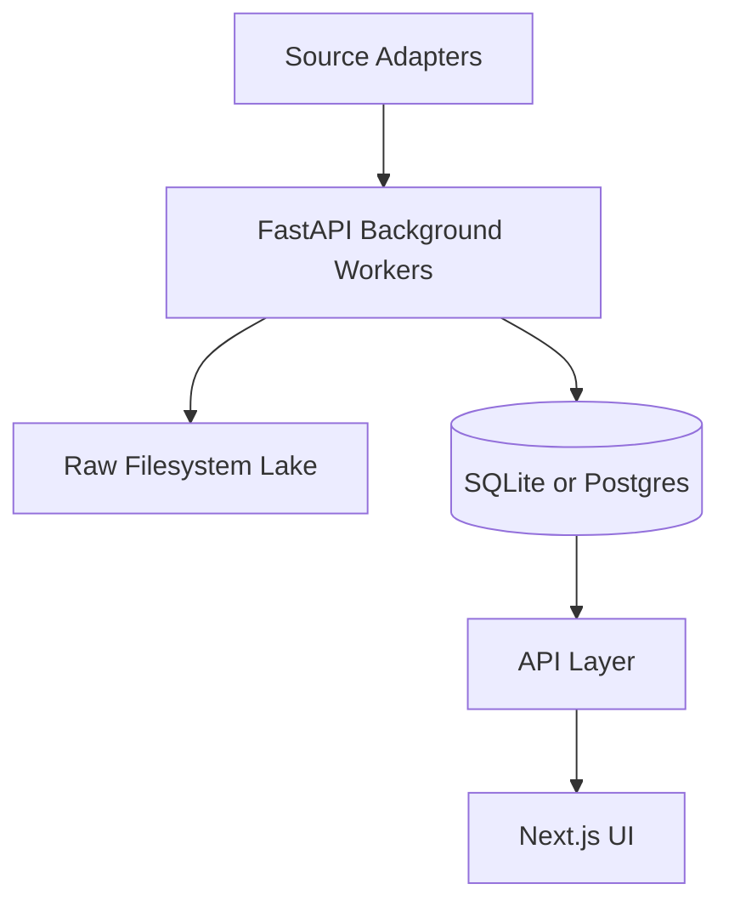
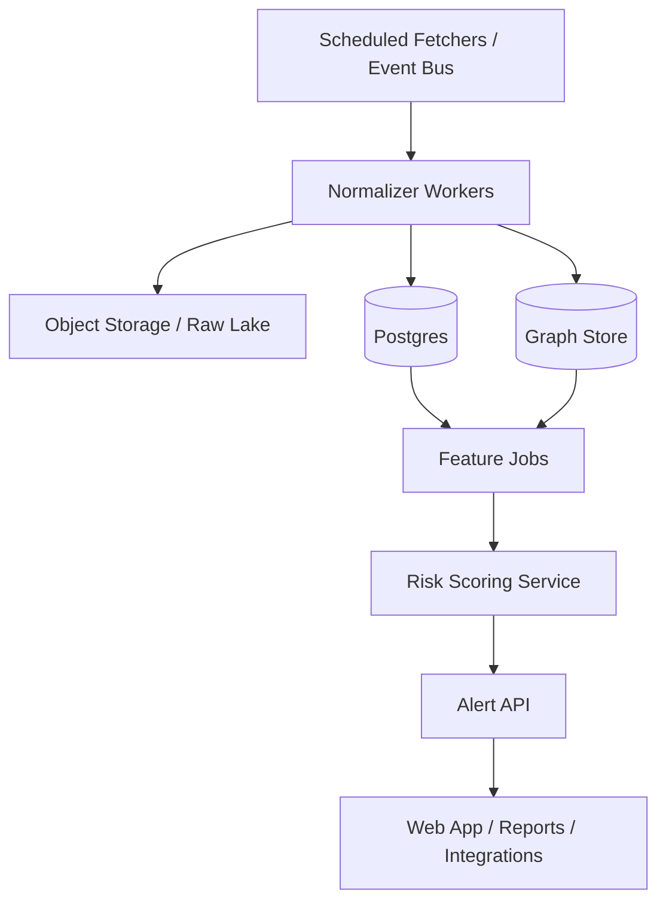

# GeoSyn Architecture Blueprint

## Purpose

This blueprint reframes GeoSyn as an exposure-aware geopolitical intelligence system rather than a generic geopolitical dashboard. It is designed to support one core workflow:

> Detect real-world geopolitical events, map them to customer-specific exposure, and surface explainable alerts with timing and severity.

The blueprint is grounded in the current codebase and extends it toward a more decision-grade architecture.

## Design Principles

- Separate high-frequency event data from low-frequency macro anchors
- Treat provenance and uncertainty as first-class features
- Keep event detection and customer exposure mapping decoupled
- Support both local-first development and cloud deployment
- Preserve raw evidence for backtesting, audits, and model reprocessing

## Target System Overview



## Current-State Mapping To Codebase

The current repository already contains much of the right scaffolding:

- App lifecycle and polling loop: [backend/app/main.py](/Users/ashishsalunkhe/My Projects/geosyn/backend/app/main.py:11)
- Ingestion coordination: [backend/app/services/ingestion_service.py](/Users/ashishsalunkhe/My Projects/geosyn/backend/app/services/ingestion_service.py:13)
- Event clustering: [backend/app/services/clustering_service.py](/Users/ashishsalunkhe/My Projects/geosyn/backend/app/services/clustering_service.py:9)
- Market ingestion: [backend/app/services/market_service.py](/Users/ashishsalunkhe/My Projects/geosyn/backend/app/services/market_service.py:10)
- Intelligence brief synthesis: [backend/app/services/timeline_service.py](/Users/ashishsalunkhe/My Projects/geosyn/backend/app/services/timeline_service.py:11)
- Relational model foundation: [backend/app/models/domain.py](/Users/ashishsalunkhe/My Projects/geosyn/backend/app/models/domain.py:1)

The missing layer is not basic plumbing. It is exposure modeling, provenance, and stronger evaluation.

## Logical Architecture Layers

## 1. Source Layer

### Event sources

- GDELT
- RSS
- Event Registry
- OSINT feeds

### Market sources

- Yahoo Finance in the current stack
- Future option: direct exchange, futures, FX, shipping-rate, and commodity feeds

### Macro sources

- FRED for higher-frequency macro and market-adjacent indicators
- IMF and World Bank for slower structural context

### Exposure sources

- Customer supplier lists
- Facilities
- Routes and ports
- Commodity dependencies
- Internal watchlists

### Compliance and ownership sources

- Sanctions lists
- Beneficial ownership
- Trade and customs proxies
- Enforcement actions

## 2. Ingestion And Normalization Layer

Every adapter should emit one canonical record type:

- `source_record`
- `normalized_document`
- `normalized_market_observation`
- `normalized_macro_observation`
- `normalized_entity`
- `normalized_exposure_record`

### Ingestion flow



### Required ingestion metadata

- source name
- source type
- source tier
- fetch timestamp
- event timestamp
- publication timestamp
- ingestion timestamp
- as-of date
- language
- jurisdiction
- content hash
- confidence and reliability attributes

## 3. Storage Pattern

### Raw evidence lake

Purpose:

- audit trail
- replay and backfill
- feature regeneration
- legal traceability

Recommended structure:

```text
data/raw/{source}/{yyyy}/{mm}/{dd}/{hhmmss}_{id}.json
```

### Operational SQL store

Purpose:

- user-facing APIs
- watchlists
- alerts
- event metadata
- entity and exposure relationships

Current implementation uses SQLite with WAL tuning ([backend/app/db/session.py](/Users/ashishsalunkhe/My Projects/geosyn/backend/app/db/session.py:1)). That is fine for local development and early pilots.

### Graph store

Purpose:

- event-to-entity and entity-to-exposure traversal
- explanation paths
- neighbor expansion
- supply chain and ownership relationships

This can begin as relational tables in PostgreSQL and migrate to Neo4j or a graph-optimized store only if query patterns demand it.

### Analytics / feature store

Purpose:

- event intensity features
- rolling topic volumes
- abnormal price moves
- lead/lag diagnostics
- alert quality features

## Core Domain Model

The current relational model is a useful start, but it should be extended into the following schema.



## Recommended Tables

### Evidence and source tables

- `sources`
- `documents`
- `document_fragments`
- `document_entities`
- `source_reliability_history`

### Event tables

- `events`
- `event_memberships`
- `event_entities`
- `event_themes`
- `event_locations`
- `event_timelines`

### Entity and graph tables

- `entities`
- `entity_aliases`
- `entity_relationships`
- `entity_geographies`
- `entity_ownership`

### Customer and exposure tables

- `customers`
- `watchlists`
- `suppliers`
- `supplier_relationships`
- `facilities`
- `ports`
- `routes`
- `commodities`
- `exposure_links`
- `criticality_scores`

### Alert and workflow tables

- `alerts`
- `alert_evidence`
- `alert_actions`
- `alert_status_history`
- `recommendations`

### Analytics and evaluation tables

- `market_series`
- `market_points`
- `macro_series`
- `macro_points`
- `feature_vectors`
- `risk_scores`
- `evaluation_labels`
- `backtest_runs`
- `model_metrics`

## Suggested SQL-Oriented Schema Sketch

```sql
create table events (
  id uuid primary key,
  canonical_title text not null,
  event_type text,
  first_seen_at timestamptz not null,
  last_seen_at timestamptz not null,
  primary_geo_id uuid,
  severity_score numeric,
  confidence_score numeric,
  status text not null,
  created_at timestamptz not null default now()
);

create table entities (
  id uuid primary key,
  canonical_name text not null,
  entity_type text not null,
  country_code text,
  metadata jsonb,
  created_at timestamptz not null default now()
);

create table exposure_links (
  id uuid primary key,
  customer_id uuid not null,
  entity_id uuid,
  supplier_id uuid,
  facility_id uuid,
  port_id uuid,
  route_id uuid,
  commodity_id uuid,
  relationship_type text not null,
  criticality_score numeric,
  metadata jsonb,
  created_at timestamptz not null default now()
);

create table alerts (
  id uuid primary key,
  customer_id uuid not null,
  event_id uuid not null,
  alert_type text not null,
  severity text not null,
  status text not null,
  headline text not null,
  summary text,
  recommendation text,
  triggered_at timestamptz not null,
  created_at timestamptz not null default now()
);
```

## Processing Architecture

## A. Event Detection Pipeline

Goal:

- cluster related evidence into canonical events
- preserve uncertainty
- avoid over-merging unrelated stories

### Event detection stages

1. ingest documents
2. deduplicate near-duplicates
3. extract entities, locations, and themes
4. cluster by time + semantics + entity overlap
5. assign event status and update event timeline

The current clustering service already provides a seed implementation, but it should evolve from semantic similarity over sparse clusters to a more explicit event model ([backend/app/services/clustering_service.py](/Users/ashishsalunkhe/My Projects/geosyn/backend/app/services/clustering_service.py:13)).

## B. Exposure Mapping Pipeline

Goal:

- determine whether an event affects something the customer cares about

### Exposure mapping stages

1. resolve event entities
2. expand graph neighbors
3. identify reachable customer assets
4. compute path weight and criticality
5. rank affected exposures



## C. Risk Scoring Layer

The risk score should be a composite, not a single-model output.

### Score components

- event intensity
- source reliability
- entity confidence
- exposure criticality
- geographic proximity
- historical disruption relevance
- market confirmation, where applicable
- customer-specific sensitivity

### Important rule

Keep exploratory econometrics separate from customer-facing certainty language. Use the math to support prioritization, not to overstate causality.

## D. Evaluation Layer

This is the most important missing architectural subsystem.

### Questions the system must answer

- Was the alert correct?
- Was it early enough to matter?
- Was it connected to a real exposure?
- Was it more useful than a naive headline-monitoring baseline?

### Required evaluation entities

- historical event labels
- disruption outcome labels
- customer action labels
- alert acceptance / dismissal labels
- lead-time measurements
- false-positive analysis



## Data Timing Strategy

GeoSyn must explicitly separate different kinds of time:

- `event_time`
- `publish_time`
- `ingestion_time`
- `as_of_date`
- `effective_date`
- `revision_date`

This matters because:

- news is near-real-time,
- markets are high-frequency,
- FRED has release timing and revisions,
- IMF WEO is biannual,
- many World Bank series are annual.

Do not blend them into one generic "freshness" concept.

## Reference Deployment Topologies

## Option 1: Local / Pilot Topology

Good for prototyping and early pilots.



### Local stack notes

- SQLite is acceptable for early development
- move to PostgreSQL once concurrent analysts, customer data segregation, and graph-heavy traversal become critical
- keep raw payload archiving independent of the DB

## Option 2: Cloud Production Topology



### Suggested cloud components

- object storage for raw evidence
- PostgreSQL for operational metadata
- queue/event bus for ingestion jobs
- worker fleet for normalization and entity resolution
- graph query layer for exposure traversal
- analytics jobs for backtesting and scoring

Keep the deployment choice flexible. The architecture matters more than the vendor.

## API Surface

The external API should eventually orient around the workflow rather than internal abstractions.

### Core endpoints

- `GET /events`
- `GET /events/{id}`
- `GET /customers/{id}/alerts`
- `GET /customers/{id}/exposures`
- `GET /alerts/{id}/evidence`
- `POST /watchlists`
- `POST /ingest/exposure`
- `GET /evaluation/metrics`

## Alert Object Contract

Every alert should answer six questions:

- What happened?
- Where did it happen?
- Who is involved?
- Why does it matter to me?
- How severe is it?
- What evidence supports it?

### Suggested alert response

```json
{
  "alert_id": "uuid",
  "customer_id": "uuid",
  "event_id": "uuid",
  "headline": "Shipping disruption risk rising in Red Sea corridor",
  "severity": "high",
  "status": "review",
  "why_it_matters": [
    "Supplier X ships through Port Y",
    "Route Z handles 32% of watched component volume"
  ],
  "affected_exposures": [
    {"type": "supplier", "name": "Supplier X", "criticality": 0.91},
    {"type": "route", "name": "Red Sea Eastbound", "criticality": 0.88}
  ],
  "evidence": [
    {"source": "Reuters", "published_at": "2026-04-16T10:30:00Z"},
    {"source": "GDELT", "published_at": "2026-04-16T10:34:00Z"}
  ],
  "recommended_action": "Escalate to sourcing continuity review within 4 hours"
}
```

## Security And Tenancy

For enterprise readiness, the architecture should assume:

- customer data isolation
- role-based access control
- encrypted storage
- audit logs for alerts and analyst actions
- provenance retention for every customer-facing claim

## Migration Path From Current System

### Phase 1

- keep FastAPI + current ingestion services
- add canonical event table
- add entity aliases and exposure tables
- add source-tier metadata

### Phase 2

- move to PostgreSQL as system of record
- separate background jobs from app lifespan loop
- add explicit backtesting and evaluation jobs

### Phase 3

- add graph query layer
- add customer-specific exposures and multi-tenant separation
- add alert explanation and workflow actions

## Summary

GeoSyn does not need a total rewrite.

It needs a clearer architecture centered on:

- evidence fidelity,
- exposure mapping,
- customer context,
- and evaluation integrity.

The current system already contains the beginnings of the ingestion, clustering, alerting, and UI stack. The next architectural leap is to turn that stack into an exposure-aware intelligence platform that can support real operational decisions.
