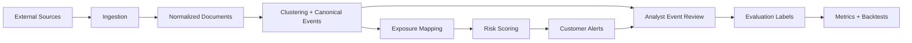

# GeoSyn System Specification

## Document Intent

This document is the next-level specification for GeoSyn.

It is meant to sit above the feature inventory and describe the system the way a serious architecture or product spec would:

- what the product is for,
- who uses it,
- what workflows it supports,
- what each subsystem does,
- which APIs power each workflow,
- what data moves through the system,
- what the outputs are,
- what is mature versus experimental.

This document should be read together with:

- [product_feature_operations_guide.md](/Users/ashishsalunkhe/My Projects/geosyn/docs/product_feature_operations_guide.md)
- [architecture_blueprint.md](/Users/ashishsalunkhe/My Projects/geosyn/docs/architecture_blueprint.md)
- [postgres_schema.md](/Users/ashishsalunkhe/My Projects/geosyn/docs/postgres_schema.md)

## System Definition

GeoSyn is an exposure-aware geopolitical intelligence system.

It ingests external information, transforms it into structured events, maps those events to customer-specific exposure, scores urgency, and produces explainable analyst and alerting outputs.

Core system promise:

> Detect what happened, determine why it matters to a specific customer, and surface the evidence, risk, and recommended action.

## Intended Users

### Primary user

Operational risk or supply-chain resilience teams who need to know:

- what geopolitical event is emerging,
- what part of their business is exposed,
- how severe the risk is,
- what action should be taken.

### Secondary users

- strategic sourcing teams
- compliance teams
- intelligence analysts
- research and geopolitical monitoring teams
- executives consuming briefings

### Tertiary users

- market-context analysts
- macro research users
- operators validating event quality

## Product Scope

### What GeoSyn is

- event detection and clustering system
- customer exposure mapping system
- analyst-facing geopolitical risk intelligence workspace
- customer-scoped alert generation and review system
- evaluation and backtesting support layer

### What GeoSyn is not yet

- full autonomous decision engine
- rigorous institutional stock attribution engine
- end-state supply-chain ERP replacement
- finished enterprise workflow platform

## Core Jobs To Be Done

### Job 1. Detect relevant geopolitical developments

Input:

- news
- RSS
- compliance or sanctions feeds
- YouTube-derived intelligence sources

Output:

- normalized documents
- candidate incidents
- tracked event clusters

### Job 2. Convert signal noise into canonical events

Input:

- ingested documents
- clustered relationships
- extracted entities

Output:

- canonical event object
- event summary
- entity set
- evidence links
- timelines

### Job 3. Map events to customer exposure

Input:

- canonical event
- customer watchlists
- uploaded exposure records
- supplier, facility, route, port, commodity, and asset links

Output:

- exposure matches
- exposure summary
- event-to-customer explanation

### Job 4. Score urgency and create operational alerts

Input:

- event
- customer scope
- exposure strength
- scoring logic

Output:

- alert
- severity
- risk rationale
- recommended action

### Job 5. Support analyst validation and system learning

Input:

- analyst judgment
- event or alert review outcomes
- backtest run metadata

Output:

- evaluation labels
- quality metrics
- run history

## System Pillars

GeoSyn currently has five main system pillars.

### Pillar 1. Ingestion

Responsibility:

- fetch external signals,
- normalize raw content,
- store source evidence,
- support recurring sync.

Key backend entrypoints:

- `POST /api/v1/ingestion/trigger`
- `POST /api/v1/ingestion/youtube`
- `POST /api/v1/ingestion/compliance`

Key backend services:

- [backend/app/services/ingestion_service.py](/Users/ashishsalunkhe/My Projects/geosyn/backend/app/services/ingestion_service.py)

Key provider classes:

- GDELT
- RSS
- YouTube
- compliance or sanctions-style provider

### Pillar 2. Event intelligence

Responsibility:

- cluster signals,
- construct canonical events,
- expose event detail,
- maintain timeline and evaluation context.

Key backend entrypoints:

- `POST /api/v1/clustering/trigger`
- `GET /api/v1/events/v2`
- `GET /api/v1/events/v2/{event_id}`
- `GET /api/v1/events/v2/{event_id}/timeline`

Key backend services:

- [backend/app/services/clustering_service.py](/Users/ashishsalunkhe/My Projects/geosyn/backend/app/services/clustering_service.py)
- [backend/app/services/event_service_v2.py](/Users/ashishsalunkhe/My Projects/geosyn/backend/app/services/event_service_v2.py)
- [backend/app/services/event_timeline_service_v2.py](/Users/ashishsalunkhe/My Projects/geosyn/backend/app/services/event_timeline_service_v2.py)

### Pillar 3. Exposure intelligence

Responsibility:

- persist customer watchlists,
- import customer exposure,
- map events to customer objects.

Key backend entrypoints:

- `GET /api/v1/customers/me`
- `GET /api/v1/watchlists/`
- `POST /api/v1/watchlists/`
- `POST /api/v1/watchlists/{watchlist_id}/items`
- `DELETE /api/v1/watchlists/items/{item_id}`
- `POST /api/v1/ingestion/exposure/csv/validate`
- `POST /api/v1/ingestion/exposure/csv`
- `GET /api/v1/events/v2/{event_id}/exposure`

Key backend services:

- [backend/app/services/exposure_import_service.py](/Users/ashishsalunkhe/My Projects/geosyn/backend/app/services/exposure_import_service.py)
- [backend/app/services/event_service_v2.py](/Users/ashishsalunkhe/My Projects/geosyn/backend/app/services/event_service_v2.py)

### Pillar 4. Alerting and workflow

Responsibility:

- turn event exposure into actionable alerts,
- support workflow state changes,
- preserve supporting evidence and audit trail.

Key backend entrypoints:

- `GET /api/v1/alerts/v2`
- `POST /api/v1/alerts/v2/generate`
- `GET /api/v1/alerts/v2/{alert_id}/evidence`
- `GET /api/v1/alerts/v2/{alert_id}/actions`
- `GET /api/v1/alerts/v2/workflow/config`
- `POST /api/v1/alerts/v2/{alert_id}/actions`

Key backend services:

- [backend/app/services/alert_service_v2.py](/Users/ashishsalunkhe/My Projects/geosyn/backend/app/services/alert_service_v2.py)

### Pillar 5. Evaluation and improvement

Responsibility:

- capture analyst feedback,
- measure usefulness,
- support backtesting and run-level metrics.

Key backend entrypoints:

- `GET /api/v1/events/v2/{event_id}/evaluation`
- `POST /api/v1/events/v2/{event_id}/evaluation`
- `GET /api/v1/evaluation/metrics`
- `GET /api/v1/evaluation/runs`
- `POST /api/v1/evaluation/runs`

Key backend services:

- [backend/app/services/evaluation_service_v2.py](/Users/ashishsalunkhe/My Projects/geosyn/backend/app/services/evaluation_service_v2.py)
- [backend/app/services/backtest_service_v2.py](/Users/ashishsalunkhe/My Projects/geosyn/backend/app/services/backtest_service_v2.py)

## High-Level System Flow

## Key Domain Objects

### 1. Document

Represents:

- a single ingested source item

Typical fields:

- title
- content
- source
- published timestamp
- URL
- raw payload reference

### 2. Canonical Event

Represents:

- the system’s normalized event object

Typical fields:

- canonical title
- event type
- subtype
- status
- summary
- evidence count
- entity count
- timeline count
- risk score
- exposure matches

### 3. Exposure link

Represents:

- a customer object connected to an entity or event-relevant target

Typical examples:

- supplier -> sanctioned entity
- route -> conflict zone
- commodity -> producer country
- facility -> geographic risk region

### 4. Alert

Represents:

- a customer-scoped operational warning created from event plus exposure context

Typical fields:

- headline
- severity
- status
- recommended action
- supporting evidence
- metadata including risk and top exposure path

### 5. Evaluation label

Represents:

- analyst feedback on event or alert usefulness or correctness

Typical examples:

- event was material
- alert was useful
- false positive

## Workflow Specifications

### Workflow A. Baseline data refresh

Goal:

- refresh core external signal pool

Steps:

1. operator or scheduler triggers ingestion
2. source adapters fetch documents
3. documents are normalized and persisted
4. records become available for clustering

Primary endpoints:

- `POST /api/v1/ingestion/trigger`
- `POST /api/v1/ingestion/compliance`

Success criteria:

- documents written successfully
- no blocking provider failure
- new records available for downstream clustering

### Workflow B. Event creation and refresh

Goal:

- maintain an up-to-date canonical event set

Steps:

1. clustering is triggered
2. related documents are grouped
3. canonical events are created or updated
4. timeline and entity context are refreshed

Primary endpoints:

- `POST /api/v1/clustering/trigger`
- `GET /api/v1/events/v2`

Success criteria:

- events are visible in the `Groups` view
- event summaries and counts are present

### Workflow C. Customer onboarding

Goal:

- establish the customer’s operational exposure graph

Steps:

1. create or resolve customer context
2. inspect onboarding readiness
3. create or refine watchlists
4. validate exposure CSV
5. import customer exposure CSV
6. create exposure links and watchlist context
7. make customer eligible for exposure-aware explanation and alerts

Primary endpoint:

- `GET /api/v1/customers/me`
- `GET /api/v1/watchlists/`
- `POST /api/v1/watchlists/`
- `POST /api/v1/watchlists/{watchlist_id}/items`
- `POST /api/v1/ingestion/exposure/csv/validate`
- `POST /api/v1/ingestion/exposure/csv`

Success criteria:

- exposure records imported
- event explanation endpoints return customer-specific results

### Workflow D. Alert generation

Goal:

- convert event plus exposure into operational alerts

Steps:

1. user triggers alert generation or background flow generates alerts
2. service evaluates events against customer scope
3. matched alerts are stored
4. frontend reads alert list

Primary endpoints:

- `POST /api/v1/alerts/v2/generate`
- `GET /api/v1/alerts/v2`

Success criteria:

- customer alert appears with severity, summary, and rationale

### Workflow E. Analyst triage

Goal:

- review and disposition a detected event or alert

Steps:

1. analyst opens event or alert
2. analyst reviews evidence, timeline, exposure path
3. analyst records evaluation or alert action

Primary endpoints:

- `GET /api/v1/events/v2/{event_id}`
- `GET /api/v1/events/v2/{event_id}/timeline`
- `GET /api/v1/events/v2/{event_id}/evaluation`
- `POST /api/v1/events/v2/{event_id}/evaluation`
- `POST /api/v1/alerts/v2/{alert_id}/actions`

Success criteria:

- action and label history recorded
- event quality loop updated

## Frontend Screen Spec

### Screen 1. Dashboard shell

Source:

- [frontend/app/page.tsx](/Users/ashishsalunkhe/My Projects/geosyn/frontend/app/page.tsx)

Responsibilities:

- initialize the page,
- orchestrate data loads,
- coordinate navigation,
- trigger full sync.

User outcome:

- one place to navigate across GeoSyn surfaces.

### Screen 2. Landscape

Source:

- [frontend/components/MarketLandscape.tsx](/Users/ashishsalunkhe/My Projects/geosyn/frontend/components/MarketLandscape.tsx)

Responsibilities:

- show tracked scenarios,
- discovery scenarios,
- exposure-linked watch items.

User outcome:

- portfolio view of monitored scenarios.

### Screen 3. Intel brief

Source:

- [frontend/components/IntelligenceBrief.tsx](/Users/ashishsalunkhe/My Projects/geosyn/frontend/components/IntelligenceBrief.tsx)

Responsibilities:

- topic-centric briefing.

User outcome:

- fast analyst explanation layer for a topic.

### Screen 4. Nexus

Source:

- [frontend/components/CausalNexus.tsx](/Users/ashishsalunkhe/My Projects/geosyn/frontend/components/CausalNexus.tsx)

Responsibilities:

- graph exploration.

User outcome:

- understand linked drivers, entities, and relationships.

### Screen 5. Groups

Source:

- [frontend/components/ClusterMap.tsx](/Users/ashishsalunkhe/My Projects/geosyn/frontend/components/ClusterMap.tsx)

Responsibilities:

- browse canonical events,
- inspect exposure and timeline,
- submit evaluation labels.

User outcome:

- review event registry and event quality.

### Screen 6. Alert panel

Source:

- [frontend/components/AlertPulse.tsx](/Users/ashishsalunkhe/My Projects/geosyn/frontend/components/AlertPulse.tsx)

Responsibilities:

- show customer-scoped alerts,
- surface risk rationale,
- allow workflow actions,
- display action history,
- expose status filtering and workflow transitions.

User outcome:

- act on operationally relevant risk.

### Screen 7. Operator workspace

Source:

- [frontend/components/InsightVault.tsx](/Users/ashishsalunkhe/My Projects/geosyn/frontend/components/InsightVault.tsx)

Responsibilities:

- show current customer readiness,
- manage watchlists,
- validate and import exposure CSVs,
- expose evaluation metrics,
- create customer-scoped evaluation runs.

User outcome:

- onboard a tenant and verify that the system is ready for exposure-aware alerting.

## API Reference By Capability

### Capability: Source ingestion

- `POST /api/v1/ingestion/trigger`
- `POST /api/v1/ingestion/youtube`
- `POST /api/v1/ingestion/compliance`

### Capability: Customer exposure onboarding

- `POST /api/v1/ingestion/exposure/csv`

### Capability: Event lifecycle

- `POST /api/v1/clustering/trigger`
- `GET /api/v1/events/v2`
- `GET /api/v1/events/v2/{event_id}`
- `GET /api/v1/events/v2/{event_id}/timeline`
- `GET /api/v1/events/v2/{event_id}/risk`
- `GET /api/v1/events/v2/{event_id}/exposure`

### Capability: Alerts

- `GET /api/v1/alerts/v2`
- `POST /api/v1/alerts/v2/generate`
- `GET /api/v1/alerts/v2/{alert_id}`
- `GET /api/v1/alerts/v2/{alert_id}/evidence`
- `POST /api/v1/alerts/v2/{alert_id}/actions`

### Capability: Scenarios and watchlists

- `GET /api/v1/scenarios/`
- `POST /api/v1/scenarios/`
- `PATCH /api/v1/scenarios/{scenario_id}`
- `POST /api/v1/scenarios/run`
- `GET /api/v1/scenarios/trending`
- `GET /api/v1/scenarios/summary`

### Capability: Analyst intelligence tools

- `GET /api/v1/intelligence/brief`
- `GET /api/v1/intelligence/live`
- `GET /api/v1/nexus/graph`
- `POST /api/v1/nexus/sync`
- `GET /api/v1/analytics/trends`
- `GET /api/v1/analytics/topic/{topic}`
- `GET /api/v1/claims/`
- `POST /api/v1/claims/extract/{doc_id}`
- `POST /api/v1/claims/verify/event/{event_id}`

### Capability: Evaluation and backtesting

- `GET /api/v1/events/v2/{event_id}/evaluation`
- `POST /api/v1/events/v2/{event_id}/evaluation`
- `GET /api/v1/evaluation/metrics`
- `GET /api/v1/evaluation/runs`
- `POST /api/v1/evaluation/runs`

### Capability: Market context

- `POST /api/v1/markets/sync`
- `GET /api/v1/markets/correlation/{ticker}`

## Current Maturity Assessment

### Strong and coherent

- event ingestion
- canonical event listing
- exposure-aware alerting foundation
- evaluation hooks
- customer-scoped v2 API model

### Useful but still mixed in identity

- market correlation
- intelligence briefing
- Nexus graph
- scenario discovery

### Present but still prototype-grade

- rigorous causal market attribution
- deep proprietary data moat
- polished operator workflows
- enterprise admin or reporting layer

## Known Narrative Problem

GeoSyn currently presents three overlapping product stories:

1. geopolitical intelligence dashboard
2. market and macro interpretation system
3. operational exposure alerting platform

The third is the most defensible and the one the backend architecture now supports best.

That means future specs, demos, and docs should center on:

> event -> exposure -> risk -> action

## What A Target “Architecture Spec” Version Should Add

To reach a truly polished architecture-spec level, the next upgrade should add:

- embedded screenshots
- sequence diagrams per workflow
- request and response examples for core endpoints
- data contracts for CSV imports and event payloads
- state diagrams for alert lifecycle
- explicit assumptions, risks, and failure modes
- non-functional requirements
- deployment topology and environment assumptions

## Recommended Follow-On Documents

1. `geosyn_operator_playbook.md`
2. `geosyn_api_contracts.md`
3. `geosyn_alert_lifecycle_spec.md`
4. `geosyn_exposure_import_spec.md`
5. `geosyn_ui_walkthrough.md`
