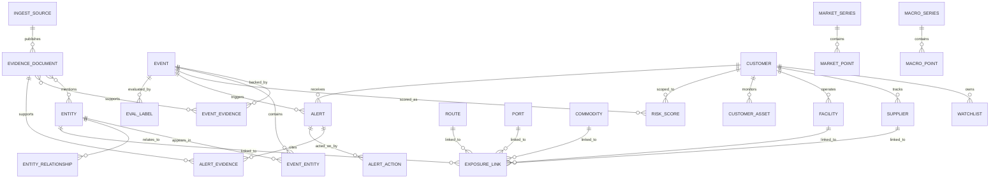

# GeoSyn PostgreSQL Schema Proposal

## Purpose

This document defines the first production-oriented PostgreSQL schema for GeoSyn. It evolves the current SQLite-first model into a structure that supports:

- canonical events
- exposure-aware alerting
- customer-specific watchlists
- richer provenance
- graph-like traversal using relational tables
- evaluation and backtesting

It is intentionally designed for PostgreSQL first, while still allowing a phased rollout from the current local system.

## Design Goals

- Preserve the useful parts of the current schema
- Introduce canonical events as the center of the model
- Add customer and exposure entities as first-class tables
- Support explainability with explicit evidence tables
- Support future graph queries without requiring an immediate graph database
- Keep low-latency operational reads separate from analytics and backtesting workflows

## Current-State Mapping

Current important tables:

- `sources`
- `documents`
- `entities`
- `event_clusters`
- `claims`
- `market_series`
- `market_points`
- `alerts`
- `causal_nodes`
- `causal_edges`
- `strategic_scenarios`
- `intelligence_archive`

Primary issues in the current schema:

- `event_clusters` are not yet canonical events
- customer-specific exposure is missing
- provenance is too light
- alerts are not scoped to customers
- graph structures are generic, but not tied to operational exposure
- evaluation entities do not exist

## Schema Strategy

The v2 schema is organized into six domains:

1. Evidence and source ingestion
2. Events and event membership
3. Entity resolution and relationships
4. Customer and exposure graph
5. Alerts and workflow actions
6. Market, macro, and evaluation support

## Schema Overview

## Domain 1: Evidence And Sources

### `ingest_sources`

Purpose:

- canonical source catalog
- source tiering
- reliability and licensing metadata

Key fields:

- `id`
- `name`
- `source_type`
- `source_tier`
- `base_url`
- `country_code`
- `language_code`
- `reliability_score`
- `license_class`
- `is_active`

### `evidence_documents`

Purpose:

- canonical store of normalized external documents and records

Key fields:

- `id`
- `source_id`
- `external_id`
- `canonical_url`
- `title`
- `body_text`
- `summary_text`
- `language_code`
- `country_code`
- `published_at`
- `event_time`
- `ingested_at`
- `content_hash`
- `raw_payload_ref`
- `source_confidence`
- `metadata`

Constraints:

- unique `(source_id, external_id)`
- index on `published_at`
- index on `content_hash`

### `document_fragments`

Purpose:

- evidence snippets for UI and explanation chains

Key fields:

- `id`
- `document_id`
- `fragment_type`
- `fragment_text`
- `start_offset`
- `end_offset`
- `metadata`

### `document_entities`

Purpose:

- many-to-many link between documents and resolved entities

Key fields:

- `document_id`
- `entity_id`
- `mention_text`
- `mention_role`
- `confidence_score`
- `metadata`

## Domain 2: Events

### `events`

Purpose:

- canonical geopolitical events or scenarios

Key fields:

- `id`
- `canonical_title`
- `event_type`
- `event_subtype`
- `status`
- `first_seen_at`
- `last_seen_at`
- `primary_geo_entity_id`
- `severity_score`
- `confidence_score`
- `summary_text`
- `metadata`

Notes:

- `events` replace the current conceptual role of `event_clusters`
- existing clusters can be migrated into this table

### `event_evidence`

Purpose:

- explicit mapping of evidence documents to events

Key fields:

- `id`
- `event_id`
- `document_id`
- `contribution_type`
- `relevance_score`
- `is_primary`
- `created_at`

### `event_entities`

Purpose:

- entities directly implicated in an event

Key fields:

- `id`
- `event_id`
- `entity_id`
- `event_role`
- `confidence_score`
- `is_primary`
- `metadata`

Possible `event_role` values:

- initiator
- target
- respondent
- affected_actor
- location
- commodity
- infrastructure

### `event_timelines`

Purpose:

- ordered event milestones or pivots

Key fields:

- `id`
- `event_id`
- `occurred_at`
- `title`
- `description`
- `source_document_id`
- `timeline_type`

## Domain 3: Entities And Relationships

### `entities`

Purpose:

- canonical resolved entities across companies, people, organizations, places, commodities, and infrastructure

Key fields:

- `id`
- `entity_type`
- `canonical_name`
- `display_name`
- `country_code`
- `region_code`
- `external_refs`
- `metadata`

Recommended `entity_type` enum:

- company
- government
- person
- location
- port
- route
- facility
- commodity
- vessel
- financial_asset
- regulator

### `entity_aliases`

Purpose:

- alias and synonym resolution

Key fields:

- `id`
- `entity_id`
- `alias`
- `alias_type`
- `language_code`

### `entity_relationships`

Purpose:

- graph-like edges between entities

Key fields:

- `id`
- `source_entity_id`
- `target_entity_id`
- `relationship_type`
- `weight`
- `valid_from`
- `valid_to`
- `source_document_id`
- `metadata`

Examples of `relationship_type`:

- located_in
- owns
- operates
- sanctions
- exports_to
- ships_through
- depends_on
- supplies

## Domain 4: Customers And Exposure Graph

### `customers`

Purpose:

- tenant and customer scope

Key fields:

- `id`
- `name`
- `slug`
- `industry`
- `primary_region`
- `created_at`

### `watchlists`

Purpose:

- logical collections of monitored things

Key fields:

- `id`
- `customer_id`
- `name`
- `watchlist_type`
- `is_default`

### `watchlist_items`

Purpose:

- items in customer watchlists

Key fields:

- `id`
- `watchlist_id`
- `entity_id`
- `item_type`
- `criticality_score`
- `metadata`

### `suppliers`

Purpose:

- customer-specific supplier records

Key fields:

- `id`
- `customer_id`
- `entity_id`
- `supplier_name`
- `tier_level`
- `country_code`
- `criticality_score`
- `metadata`

### `facilities`

Purpose:

- tracked customer facilities or critical operating sites

Key fields:

- `id`
- `customer_id`
- `entity_id`
- `facility_name`
- `facility_type`
- `country_code`
- `lat`
- `lng`
- `criticality_score`
- `metadata`

### `ports`

Purpose:

- normalized ports for exposure mapping

Key fields:

- `id`
- `entity_id`
- `port_code`
- `country_code`
- `lat`
- `lng`

### `routes`

Purpose:

- normalized corridors, sea lanes, or logistics routes

Key fields:

- `id`
- `entity_id`
- `route_name`
- `route_type`
- `origin_port_id`
- `destination_port_id`
- `metadata`

### `commodities`

Purpose:

- normalized strategic inputs and market-sensitive materials

Key fields:

- `id`
- `entity_id`
- `commodity_code`
- `sector`
- `metadata`

### `customer_assets`

Purpose:

- customer-monitored assets, programs, or portfolio holdings

Key fields:

- `id`
- `customer_id`
- `entity_id`
- `asset_label`
- `asset_type`
- `criticality_score`
- `metadata`

### `exposure_links`

Purpose:

- the central customer exposure graph edge table

Key fields:

- `id`
- `customer_id`
- `source_object_type`
- `source_object_id`
- `target_entity_id`
- `relationship_type`
- `criticality_score`
- `exposure_weight`
- `confidence_score`
- `valid_from`
- `valid_to`
- `metadata`

Examples:

- supplier depends_on commodity
- facility ships_through port
- customer_asset depends_on supplier
- facility located_in country

## Domain 5: Alerts And Workflow

### `alerts`

Purpose:

- customer-scoped event alerts

Key fields:

- `id`
- `customer_id`
- `event_id`
- `alert_type`
- `severity`
- `status`
- `headline`
- `summary_text`
- `recommended_action`
- `triggered_at`
- `resolved_at`
- `metadata`

Recommended `status` enum:

- new
- monitor
- review
- escalated
- mitigated
- dismissed

### `alert_evidence`

Purpose:

- explicit evidence shown for an alert

Key fields:

- `id`
- `alert_id`
- `document_id`
- `evidence_type`
- `relevance_score`
- `fragment_id`
- `metadata`

### `alert_actions`

Purpose:

- workflow actions and audit trail

Key fields:

- `id`
- `alert_id`
- `action_type`
- `actor_id`
- `notes`
- `created_at`
- `metadata`

Examples:

- acknowledged
- escalated
- assigned
- muted
- dismissed
- exported

## Domain 6: Markets, Macro, And Evaluation

### `market_series`

Purpose:

- normalized financial or commodity series

Key fields:

- `id`
- `ticker`
- `name`
- `asset_class`
- `exchange_code`
- `currency_code`
- `metadata`

### `market_points`

Purpose:

- time series observations for market instruments

Key fields:

- `id`
- `series_id`
- `observed_at`
- `open_value`
- `high_value`
- `low_value`
- `close_value`
- `volume`
- `metadata`

### `macro_series`

Purpose:

- normalized macro series catalog

Key fields:

- `id`
- `series_code`
- `provider_name`
- `name`
- `frequency`
- `unit`
- `metadata`

### `macro_points`

Purpose:

- macro observations with explicit data timing semantics

Key fields:

- `id`
- `series_id`
- `period_start`
- `period_end`
- `as_of_date`
- `release_date`
- `observed_value`
- `revision_number`
- `metadata`

### `risk_scores`

Purpose:

- scored event or alert relevance for a customer

Key fields:

- `id`
- `customer_id`
- `event_id`
- `alert_id`
- `score_type`
- `score_value`
- `component_scores`
- `scored_at`

### `evaluation_labels`

Purpose:

- explicit labeled outcomes for backtesting

Key fields:

- `id`
- `event_id`
- `customer_id`
- `label_type`
- `label_value`
- `labeled_at`
- `metadata`

Examples of `label_type`:

- disruption_occurred
- alert_was_useful
- event_was_material
- false_positive
- lead_time_hours

### `backtest_runs`

Purpose:

- immutable record of evaluation runs

Key fields:

- `id`
- `run_name`
- `config_json`
- `started_at`
- `completed_at`
- `metrics_json`

## Recommended Postgres Conventions

- Use `uuid` primary keys for new tables
- Use `jsonb` rather than `json` for operational flexibility
- Add `created_at` and `updated_at` to all mutable operational tables
- Add partial indexes for active alerts and open workflow states
- Add GIN indexes on `jsonb` only where query patterns justify it

## Suggested Indexes

High-value indexes:

- `evidence_documents (published_at desc)`
- `evidence_documents (source_id, external_id)`
- `events (status, last_seen_at desc)`
- `event_evidence (event_id, relevance_score desc)`
- `entity_aliases (alias)`
- `entity_relationships (source_entity_id, relationship_type)`
- `entity_relationships (target_entity_id, relationship_type)`
- `alerts (customer_id, status, triggered_at desc)`
- `exposure_links (customer_id, source_object_type, source_object_id)`
- `risk_scores (customer_id, event_id, score_type)`

## Enum Recommendations

Use Postgres enums for stable values only:

- `entity_type`
- `event_status`
- `alert_status`
- `alert_severity`

Use text + validation tables for values likely to evolve:

- `relationship_type`
- `event_role`
- `label_type`

## Migration Notes

### Tables to preserve with light adaptation

- `sources` -> migrate into `ingest_sources`
- `documents` -> migrate into `evidence_documents`
- `entities` -> migrate into `entities`
- `market_series` -> preserve
- `market_points` -> preserve with richer OHLC structure later

### Tables to reframe or replace

- `event_clusters` -> replace with `events`
- `alerts` -> replace with customer-scoped `alerts`
- `causal_nodes` and `causal_edges` -> replace with `entity_relationships` and `exposure_links`
- `claims` -> preserve later only if explicit claim-verification remains productized

### Tables to keep as tactical support

- `strategic_scenarios`
- `intelligence_archive`

These can continue to exist during transition, then either be absorbed or retained as cache/support tables.

## Implementation Order

1. Introduce `events`, `event_evidence`, `event_entities`
2. Introduce `customers`, `watchlists`, `watchlist_items`
3. Introduce `suppliers`, `facilities`, `customer_assets`
4. Introduce `exposure_links`
5. Introduce customer-scoped `alerts` and `alert_evidence`
6. Introduce `macro_series`, `macro_points`, `risk_scores`, `evaluation_labels`

## Summary

This schema keeps GeoSyn relational, explainable, and migration-friendly while adding the missing concepts required for an exposure-aware product. It gives the engineering team a concrete target for the next phase without forcing an immediate platform rewrite.
